## 第一部分、原型系统概述

### 1、联邦学习简介

     &emsp;随着物联网和智能设备的快速发展，移动电话、可穿戴设备和自动驾驶汽车等智能终端每天都会产生大量数据。虽然随着训练数据量的增大和多样化的增多，机器学习所训练的模型会变得更好，但是人们对于个人隐私的重视也越来越强。除此之外，传统的机器学习方法通常部署在中央服务器或云中，以对收集的数据信息进行统一和密集的训练。而物联网设备产生的数据是不可估量的，如此海量数据的处理和传输会产生极大的成本，而且会加大网络负载，造成传输拥堵和数据处理的延迟。同时，数据本身的传输会大大增加数据隐私泄露的风险。  

​     &emsp;如何在满足数据隐私、安全和监督要求的前提下，设计一个机器学习框架，让人工智能系统能够更加高效、准确地共同使用各自的数据，是当前人工智能发展的一个重要课题。同时由于物联网设备的长足发展，边缘设备具有了一定的计算能力和存储能力。在这样的环境中，联邦机器学习（Federated Machine Learning），或者简称为联邦学习（Federated Learning），作为一种行之有效的解决方案引起了人们的广泛关注。作为一种新的分布式机器学习算法，联邦学习可以在不直接获取设备私有数据的基础上，通过协调跨设备的模型训练与参数聚合完成AI模型任务。除了保护用户隐私和数据安全，联邦学习的另一发展动机是为了最大化地利用云系统下终端设备的计算能力，如果只在设备和服务器之间传输计算结果而不是原始数据，那么通信将会变得极为高效。因此，联邦学习在降低传统集中式机器学习的通信计算开销，以及消除数据隐私风险等方面，具有重要理论创新和实践落地价值。  

​     &emsp;联邦学习有三大构成要素：数据源、联邦学习系统、用户。三者间关系如图所示，在联邦学习系统下，各个数据源方进行数据预处理，共同建立及其学习模型，并将输出结果反馈给用户。

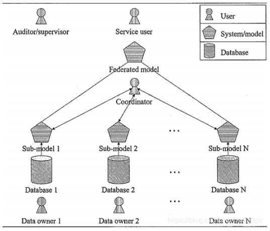

​    &emsp;联邦学习定义了机器学习框架，在此框架下通过设计虚拟模型解决不同数据拥有方在不交换数据的情况下进行协作的问题。虚拟模型是各方将数据聚合在一起的最优模型，各自区域依据模型为本地目标服务。联邦学习要求此建模结果应当无限接近传统模式，即将多个数据拥有方的数据汇聚到一处进行建模的结果。在联邦机制下，各参与者的身份和地位相同，可建立共享数据策略。具体地说，每个客户端都有一个本地训练数据集，服务器初始化的全局模型由客户端进行下载，用于使用它们的私有数据进行训练；训练结束后，客户端将其模型上传到服务器。服务器聚合本地模型以生成更新后的全局模型，该更新后的全局模型随后由客户端下载用于再次训练。重复这个训练和聚合过程，直到达到学习收敛。  

​    &emsp;令联邦学习任务**Γ**中有N个联邦学习模型训练参与方{F<sub>1</sub>，F<sub>2</sub>，...，F<sub>N</sub>}，各参与方拥有的数据/标签记为{*χ*<sub>1</sub>，*χ*<sub>2</sub>，...，*χ*<sub>N</sub>}/{Y<sub>1</sub>，Y<sub>2</sub>，...，Y<sub>N</sub>}。传统的机器学习要求训练一个模型M<sub>TRD</sub>，使其训练过程要求其参数W<sub>TRD</sub>最小化现有的数据并集与其对应的标签的经验损失，即：

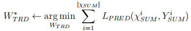

其中L<sub>PRED</sub>为训练损失函数，且：

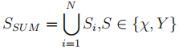

联邦学习要求所有训练参与方共同训练一个联邦学习模型M<sub>FED</sub>，在该模型训练的过程中，所有的数据应当仅在参与方本地进行自我管理，任何一个训练参与方F<sub>i</sub>不得向其他参与方公开自己的本地数据/标签*χ*<sub>i</sub>/Y<sub>i</sub>。我们期望在保证模型精度评价指标下，联邦学习模型的精度应该尽可能地逼近集中式数据的模型训练得到机器学习模型，即：argmin δ，其中δ为联邦精度损失，有:

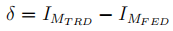

​    &emsp;相比数据集中式的训练方法，联邦学习允许各参与方对数据拥有完全的控制权，很好地保护了各参与方及其用户的隐私，但也由于数据信息交换的不充分性导致模型精度略有下降。故一般而言，*δ* 为一个非负实数。

### 2、系统功能介绍

​     &emsp;基于`Pytorch`机器学习库，搭建了端-云联邦智能系统。针对图像识别场景，采用`Cifar10`数据集，本系统以`Alexnet`神经网络模型为例实现一个图片分类应用，启动多个客户端与一个服务器共同参与联邦学习。该端-云联邦智能系统功能实现主要包括三个部分：`Server`侧功能实现，`Client`侧功能实现，以及通信模块功能实现。`Client`侧主要负责联邦学习中的本地模型训练以及联邦学习模型参数的更新与上传。首先，`client`在本地进行数据处理操作，完成数据集划分。然后，客户端开启`socket`与服务端建立连接，通过通信模块中的消息发送功能接收来自服务器侧的模型，从而进入本地模型训练阶段；完成训练后，通过通信模块中的消息接收功能向服务端上传本地训练模型，同时保存本地训练信息以及每轮的训练模型。相应地，`Server`主要负责联邦学习中的模型聚合功能，以及模型参数的分发与接收。本系统采用加权平均的思想进行全局模型的更新。最后在完成联邦学习训练之后，客户端在测试集上进行推理并保存结果。

### 3、系统架构描述

- #### 客户端代码结构

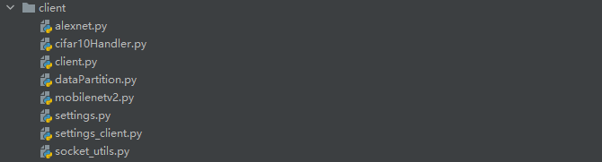

`alexnet.py`：网络模型文件，用于创建`Alexnet`神经网络模型，包括特征提取模块和分类模块。 

`cifar10Handler.py`： 数据处理文件，包括`cifar10`数据集下载处理的`Handler`和质量评估的`Benchmarker`。

`client.py`：客户端启动文件，用于启动客户端侧模型训练进程。

`dataPartition.py`：客户端数据文件，主要进行客户端独立同分布处理。

`mobilenetv2.py`：网络模型文件，用于创建`Mobilenet`神经网络模型。

`settings.py`：服务器侧配置文件，设置`batch_size`、`learning_rate`等超参数，以及`Mobilenet`特有参数(面向使用`mobilenet`网络模型训练)。

`settings_client.py`：客户端侧对应配置文件，包括ip获取和超参数设置。

`socket_utils.py`：socket文件，用于创建套接字，在服务器和客户端之间建立连接以及数据请求。

- #### 服务端代码结构


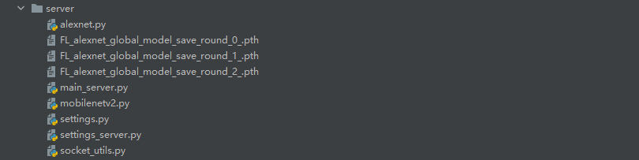

`alexnet.py`：网络模型文件，用于创建`Alexnet`神经网络模型，包括特征提取模块和分类模块。 		

`main_server.py`：服务端启动文件，用以启动服务端侧的模型训练任务。

`mobilenetv2.py`：网络模型文件，用于创建`Mobilenet`神经网络模型。

`settings.py`：服务器侧配置文件，设置`batch_size`、`learning_rate`等超参数，以及`Mobilenet`特有参数(面向使用`mobilenet`网络模型训练)。

`settings_server.py`：服务器侧对应配置文件，设置`batch_size`、`learning_rate`等超参数，以及服务器IP地址(面向使用`alexnet`网络模型训练)。

`socket_utils.py`：socket文件，用于创建套接字，在服务器和客户端之间建立连接以及数据请求。

`FL_alexnet_global_model_save_round_*_.path`：每一轮训练保存的全局模型文件。

*`mobilenetv2.py`提供了一个和`alexnet`网络模型对等的进行联邦学习训练的神经网络模型选择，两者差异主要存在于模型结构，联邦学习训练流程和超参数设置基本一致，因此，本文档只对使用`alexnet`模型训练进行说明。*

### 4、系统处理流程介绍

- #### 联邦学习流程
  
  1. 客户端下载全局模型
  2. 客户端使用本地数据进行模型更新
  3. 将本地更新模型上传至服务器
  4. 服务器聚合客户端上传模型

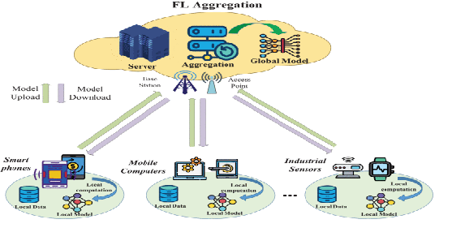

- #### 系统服务端侧流程

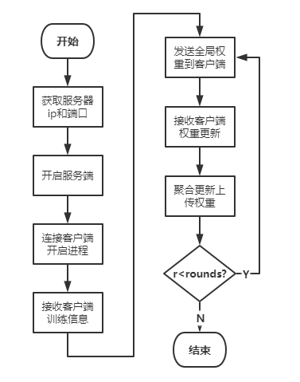

- #### 系统客户端侧流程

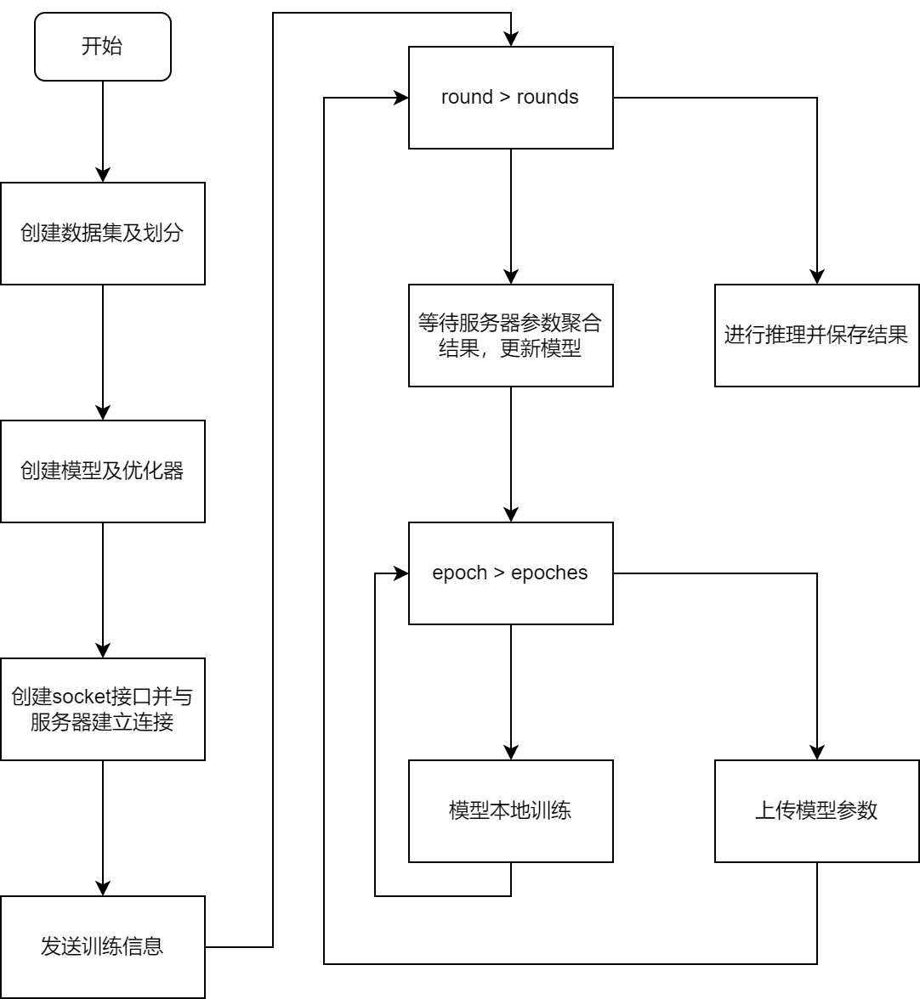


## 第二部分、客户端部分代码设计

### 1、主要数据结构及含义

- 保存文件的名称

```python
xlsname = 'client_federatedLearning_train_perepoch_info.csv'
xlsname3 = 'FL_perround_train_info.csv'
```
- 训练集、测试集、验证集

```python
 train_dataloader, data_size, total_batch = cifar10Handler.DataHandler.get_train_dataloader(
        batch_size=batch_size,
        transform=prep,
        data_proportion=data_proportion) 

test_dataloader = cifar10Handler.DataHandler.get_test_dataloader(
        transform=prep,
        batch_size=batch_size)

validation_data = cifar10Handler.DataHandler.get_validation_data(transform=prep, n_samples=batch_size)
```

- 训练模型

```python
train_model = Alexnet_whole().to(device)
```

- loss函数

```python
criterion = nn.CrossEntropyLoss()
```

- 优化器

```python
optimizer = optim.SGD(
        params=train_model.parameters(),
        lr=lr,
        momentum=momentum,
        weight_decay=weight_decay)
```

### 2、主要函数处理流程

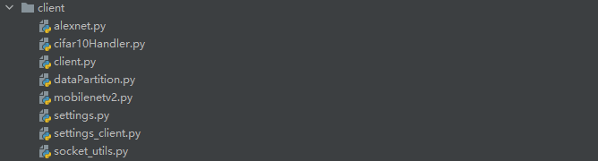

##### 1、client.py

- 数据下载与处理

调用`cifar10Handler`模块进行训练数据下载与处理，包括客户端本地数据的独立同分布划分。

```python
data_proportion = settings.data_proportion
prep = cifar10Handler.DataHandler.preprocess()
batch_size = settings.TRAIN_CONFIG["batch_size"]
train_dataloader, data_size, total_batch = cifar10Handler.DataHandler.get_train_dataloader(
    batch_size=batch_size,
    transform=prep,
    data_proportion=data_proportion)

print("data size: {}, total batch: {}, len(train_dataloader): {}, batch_size: {}".format(
    data_size, total_batch, len(train_dataloader), batch_size))

test_dataloader = cifar10Handler.DataHandler.get_test_dataloader(
    transform=prep,
    batch_size=batch_size)
validation_data = cifar10Handler.DataHandler.get_validation_data(transform=prep, n_samples=batch_size)
```

- 模型加载建立连接

本地加载模型并开启客户端`socket`与服务端建立连接。

```python
train_model = Alexnet_whole().to(device)
s = socket.socket()
s.connect((settings.host, settings.port))
```

- 端侧训练

在成功建立连接之后就可以开始联邦学习训练，训练过程包括加载全局模型、本地模型更新与模型更新上传三个主要步骤。同时维护文件保存本地epoch信息以及每轮训练模型和信息，记录训练损失和精度以及模型大小。

```python
for roundid in range(settings.TRAIN_CONFIG['rounds']):
    client_train_perRound_time = time.time()
    print("------Waiting for receiving aggregated loss-----")
    #get model
    aggregated_weights, rece_size, rece_time = socket_utils.recv_msg(s)
    print('-----------Received aggregated weights-----------')
    client_receiveSize_list.append(rece_size)
    client_receive_time_list.append(rece_time)
    round_train_wait_time = rece_time - last_wait_time
    
    d = copy.deepcopy(aggregated_weights)
    train_model.load_state_dict(d)
    modelSavePt = 'fl_client_alexnet_whole_model_save_round_' + str(roundid) + '_.pth'
    torch.save(train_model, modelSavePt)
    #local training
    for eid in range(settings.TRAIN_CONFIG['n_epochs']):
        loss_per_batch = []
        acc_per_batch = []
        n_correct_in_epoch = 0
        startEpochTime = time.time()
        optimizer, lr = adjust_learning_rate(optimizer,roundid,eid,lr,settings.TRAIN_CONFIG["lr_step"])

        train_model.train()
        for k, data in enumerate(train_dataloader):
            x, labels = data
            x = x.to(settings.device)
            labels = labels.clone().detach().long().to(settings.device)

            optimizer.zero_grad()
            predictions = train_model(x)
            loss = criterion(predictions, labels)
            loss.backward()
            optimizer.step()
            
            acc, n_correct = cifar10Handler.Benchmarker.get_accuracy_statistics(predictions, labels)
            loss_per_batch.append(loss.detach().item())
            acc_per_batch.append(acc)
            n_correct_in_epoch += n_correct

            print(" * batch -{:3d} || Loss={:.4f}  TrainAcc={:4.1f}%".
                  format(k, loss_per_batch[-1], acc * 100))

        e_loss = np.mean(loss_per_batch)
        e_acc = float(n_correct_in_epoch) / data_size
        train_loss.append(e_loss)
        train_acc.append(e_acc)
        endEpochTime = time.time() - startEpochTime
        print("EPOCH {:3d} || TrainAcc={:4.3f}%  T-{:.3f} LR-{:f}".format(eid, e_acc * 100, endEpochTime, lr))
       
        result_info = {
            'eid': [eid],
            'train loss (epoch)': [e_loss],
            'train acc (epoch)': [e_acc],
            'per epoch time': [endEpochTime]
        }
        # save result
        result_info_pd = pd.DataFrame.from_dict(result_info)
        p1 = os.path.exists(xlsname)
        if p1:  # 文件已经存在时，直接打开并追加内容，header=False
            result_info_pd.to_csv(xlsname, mode='a', index=False, header=False)
        else:  # 文件不存在时，需要添加header
            result_info_pd.to_csv(xlsname, mode='a', index=False)
        time.sleep(0.5)

    perround_elapsed_time = time.time() - client_train_perRound_time
    record_perRound_time.append(perround_elapsed_time)
    print('Finish {}-th round training with time {}'.format(roundid, perround_elapsed_time))
    #upload model
    print("------Update weights to server-----")
    msg = train_model.state_dict()
    send_size2, send_time2 = socket_utils.send_msg(s, msg)
```

- 模型推理

```python
train_model.eval()

bench_results = cifar10Handler.Benchmarker.run_full_benchmark(train_model)
print('-----After {}s, Federated Learning finished with test acc {}'.
      format(totalTime, bench_results["test_acc"]))
```

- 学习率衰减

每经过固定epoch的本地更新后将学习率减半，保证模型在训练后期不会有太大的波动，从而更加接近最优解。

```python
def adjust_learning_rate(optimizer, round, epoch, learnRate, step=40):
    if ((round+1) * (epoch+1)) % step == 0:
        learnRate = learnRate * .5
        for param_group in optimizer.param_groups:
            param_group['lr'] = learnRate
    return optimizer, learnRate
```

##### 2、cifar10Handler.py
- `DataHandler`类

负责数据处理、创建`dataloader`、创建训练集等操作，并在创建训练集的时候进行`label`的统计。

```python
class DataHandler:
    '''Define local cifar10 data'''
    CIFAR10_DATA_DIR = "../data"
    N_WORKERS = 2

    @classmethod
    def preprocess(cls, mean=(0.4913997551666284, 0.48215855929893703, 0.4465309133731618), std=(0.24703225141799082, 0.24348516474564, 0.26158783926049628)):
        transform_train = transforms.Compose([
            transforms.RandomCrop(32, padding=4),
            transforms.RandomHorizontalFlip(),
            transforms.RandomRotation(15),
            transforms.ToTensor(),
            transforms.Normalize(mean, std)
        ])
        return transform_train

    @classmethod
    def get_train_dataloader(cls, batch_size, transform, data_proportion) -> DataLoader:
        cifar10_training_set = torchvision.datasets.CIFAR10(train=True, root=cls.CIFAR10_DATA_DIR, transform=transform, download=True)

        # get local data set
        local_datasize = data_proportion * len(cifar10_training_set)
        print('define local data size:', local_datasize)
        print('----------------------------------------------------------------------')
        client_train_DatasetIdxs = iid_partition(cifar10_training_set, local_datasize)

        # 设置数据索引的同时，对本地trainloader初始化
        local_train_set = CustomDataset(cifar10_training_set, client_train_DatasetIdxs)
        local_train_loader = localTrainLoader(client_train_DatasetIdxs, cifar10_training_set, batch_size)
        print('----------------------------------------------------------------------')
        classes = np.array(list(local_train_set.dataset.class_to_idx.values()))
        num_classes = len(classes)
        idxs = local_train_set.dataset.class_to_idx
        print("Total classes: {}".format(num_classes))
        print()
        print("class to index:{} \tType: {}".format(idxs, type(idxs)))
        print()
        print("Classes: {} \tType: {}".format(classes, type(classes)))
        print()
        print("Assigned training set data size:", len(local_train_set))

        # 计算每一类有多少个样本
        # 构建classes_num的k-v字典
        classes_array = np.array([])
        for batch, imgs in enumerate(local_train_loader):
            classes_array = np.concatenate((classes_array, imgs[1].numpy()), axis=0)
        print("class array:{}".format(classes_array))
        # 计算每一类出现多少次
        labels, counts = np.unique(classes_array, return_counts=True)
        print('{class: num}:\n', dict(zip(labels, counts)))
        print('counts sum: ', counts.sum())
        print("Load Training Data Done!")
        return local_train_loader, len(local_train_set), len(local_train_loader)

    @classmethod
    def get_validation_data(cls, n_samples=100, transform=None) -> (torch.Tensor, torch.Tensor):
        test_data = torchvision.datasets.CIFAR10(train=False, root=cls.CIFAR10_DATA_DIR, transform=transform,
                                                      download=True)
        dataloader = DataLoader(test_data, batch_size=n_samples, shuffle=True, num_workers=cls.N_WORKERS)
        validation_input, validation_labels = iter(dataloader).next()
        # print(Counter(validation_labels.numpy()))
        return validation_input.to(settings.device), validation_labels.to(settings.device)

    @classmethod
    def get_test_dataloader(cls, transform, batch_size) -> (torch.Tensor, torch.Tensor):
        # prep = cls.preprocess(augmentations=False, padding_to_32=padding_to_32)
        test_data = torchvision.datasets.CIFAR10(train=False, root=cls.CIFAR10_DATA_DIR, transform=transform,
                                                      download=True)
        test_loader = DataLoader(test_data, batch_size=batch_size, num_workers=cls.N_WORKERS)
        return test_loader

    @classmethod
    def get_class_names(cls):
        #  ('airplane', 'car', 'bird', 'cat', 'deer', 'dog', 'frog', 'horse', 'ship', 'truck')
        data = torchvision.datasets.CIFAR10(train=True, root=cls.CIFAR10_DATA_DIR, download=True)
        return data.classes
```

- `Benchmarker`类

数据集测试部分，负责创建模型的`eval`方法，并且对其进行数据统计（准确率、运行时间等等）。

```python
class Benchmarker:
    """Quality evaluation and performance benchmarking."""

    @staticmethod
    def get_accuracy_statistics(predictions: torch.Tensor, labels: torch.Tensor):
        predicted_classes = predictions.argmax(dim=1)
        assert predicted_classes.nelement() == labels.nelement(), "Predictions and Labels have different lengths!!"
        num_correct = float(sum(predicted_classes == labels.to(settings.device)))
        acc = num_correct / float(labels.nelement())
        return acc, num_correct

    @classmethod
    def evaluate(cls, model: nn.Module, input_tensor, labels, criterion, description="", verbose=True):
        model.eval()
        with torch.no_grad():
            predictions = model(input_tensor)
            loss = criterion(predictions, labels)
            acc, _ = cls.get_accuracy_statistics(predictions, labels)
            n = len(labels)
        if verbose:
            print("\n{}".format("=" * 50))
            print("[{:^17s}] || Loss={:.4f}  Acc={:4.1f}%  n={}".
                  format(description.upper(), loss.detach().item(), acc * 100, n))
        return loss, acc

    @classmethod
    def evaluate_test_data(cls, model: nn.Module, criterion):
        model.eval()

        prep_transform = DataHandler.preprocess()
        dataloaders_list = list()
        dataloaders_list.append(DataHandler.get_test_dataloader(transform=prep_transform, batch_size= settings.batch_size))

        n = len(dataloaders_list[0].dataset)
        acc_list, loss_list = [], []
        with torch.no_grad():
            for dlid, data_loader in enumerate(dataloaders_list):
                num_correct = 0
                losses = []
                for test_input, test_labels in data_loader:
                    test_labels = test_labels.to(settings.device)
                    predictions = model(test_input.to(settings.device))
                    loss = criterion(predictions, test_labels)
                    losses.append(loss.detach().item())
                    _, num_correct_in_batch = cls.get_accuracy_statistics(predictions, test_labels)
                    num_correct += num_correct_in_batch
                test_loss = np.mean(losses)
                test_acc = num_correct / n
                acc_list.append(test_acc)
                loss_list.append(test_loss)
                print("[{:^17s}] || Loss={:.4f}  Acc={:4.2f}%  n={}".
                      format("TEST EVAL- [{:}]".format(dlid), test_loss, test_acc * 100, n))
        return min(loss_list), max(acc_list)

    def get_test_dataset(cls):
        # padding_to_32 = True if model.__class__.__name__ == "EfficientNet" else False
        prep_default = DataHandler.preprocess()
        dataloaders_list = list()
        dataloaders_list.append(DataHandler.get_test_dataloader(transform=prep_default, batch_size= settings.batch_size))
        #dataloaders_list.append(DataHandler.get_test_dataloader(transform=prep_transform, batch_size=settings.TRAIN_CONFIG["batch_size"])

        return dataloaders_list

    @staticmethod
    def run_net_summary(model, input_shape=(3, 32, 32)):
        summary(model, input_shape)
        total_params = sum(p.numel() for p in model.parameters() if p.requires_grad)
        return total_params

    @staticmethod
    def get_inference_time(model: nn.Module):
        batch_size = 100
        n_iters = 100
        prep = DataHandler.preprocess()
        data, dataSize, totalBatch = DataHandler.get_train_dataloader(batch_size=batch_size, transform=prep, data_proportion=settings.data_proportion)
        times_per_iter = []
        for iter_id, (x, _) in enumerate(data):
            if iter_id >= n_iters:
                break
            start = time.time()
            _ = model(x.to(settings.device))
            _.cpu()
            end = time.time()
            t = end - start
            times_per_iter.append(t)
        t_mean = np.mean(times_per_iter)
        t_std = np.std(times_per_iter)
        print("[{:^17s}] || t_mean={:.1f}[millisec]  t_std={:.1f}[millisec]  n_iters={}".
              format("TIMING per 1k", t_mean, t_std, n_iters))
        return t_mean, t_std

    @classmethod
    def run_full_benchmark(cls, model: nn.Module, verbose=False):
        print("\nStarting full_benchmark . . .")
        loss_criterion = nn.CrossEntropyLoss()
        test_loss, test_acc = cls.evaluate_test_data(model, loss_criterion)
        inference_time = cls.get_inference_time(model)
        n_params = sum(p.numel() for p in model.parameters() if p.requires_grad)
        results = OrderedDict()
        results["model"] = model.__class__.__name__
        results["test_acc"] = test_acc
        results["test_cross_entropy"] = test_loss
        results["n_params"] = n_params
        results["inference_time_mean"] = inference_time[0]
        results["inference_time_std"] = inference_time[1]
        if verbose:
            print(results)
        return results
```
##### 3、dataPartition.py

- 自定义数据`Idx`生成器

可根据自定义的参数进行数据集`batch`或者`sample`级别的数据划分。

```python
def customizedIdxsGenerator(classes_mapper, Bias_array, local_datasize):
    # list为可变对象，需要深拷贝
    Bias_num_array = copy.deepcopy(Bias_array)
    for i in range(len(Bias_array)):
        Bias_num_array[i] = int(local_datasize * Bias_array[i])

    local_dataitem_idxs = np.array([])

    for key in classes_mapper.keys():
        # 先把classes_mapper[key] list类型转化numpy
        # classes_mapper[key]=np.array(classes_mapper[key])
        # concatenate: 拼接local_dataitem_idxs和np.random.choice
        # np.random.choice: 从classes_mapper[key]中随机抽取数字，组成int(Bias_num_array[key])大小的数组，不可以取相同数字
        local_dataitem_idxs = np.concatenate((local_dataitem_idxs,
                                              np.random.choice(classes_mapper[key], int(Bias_num_array[key]),
                                                               replace=False)), axis=0)

    np.random.shuffle(local_dataitem_idxs)
    local_dataitem_idxs = local_dataitem_idxs.astype(int)
    return local_dataitem_idxs.tolist()

```

- 独立同分布划分模块

通过对数据集的统计方式进行数据ids的获取，详细可见注释

```python
# 独立同分布比较简单，直接随机抽样即可实现每个设备较为均匀的标签分布
def iid_partition(dataset, local_datasize):
    labels_num = 10
    labels_array = [i for i in range(labels_num)]

    classes_mapper = {}
    for item in labels_array:
        # numpy64转int
        classes_mapper[int(item)] = []
    # 根据key映射value
    for i in range(len(dataset)):
        targetForOnce = int(dataset.targets[i])        # tensor转int
        classes_mapper[targetForOnce].append(i)
    for key in classes_mapper.keys():
        # list转为numpy数组，所以mapper的k-v类型是int-numpy_array
        classes_mapper[key] = np.array(classes_mapper[key])

    # 遍历每个客户端，为它选择它的标签分布，再获取对应的数据索引
    # for i in range(clients_num):
    # client_distribution = np.array([0.1 for i in range(labels_num)])
    client_distribution = []
    iswork = True
    tmp_array = []
    each_upper = 1 / (10 * settings.data_proportion)
    print("Each upper bound is :", each_upper)
    # 均匀分布的话，每个类为0.1
    # 1/(10/2)，每两个类为一组，共5组，5组的分布和为1，每一组为0.2
    group_upper = 0.2
    check_sum = 0
    upper = each_upper if group_upper > each_upper else group_upper
    # 5个数大于0.1,5个数小于0.1
    temp_data = np.random.uniform(0.1, high=upper, size=5)
    tmp_array = np.concatenate((tmp_array, temp_data))
    for i in range(5):
        temp_data[i] = 0.2 - temp_data[i]
    tmp_array = np.concatenate((tmp_array, temp_data))
    client_distribution = np.random.choice(tmp_array, labels_num, replace=False)
    print('client distribution: ', client_distribution)
    for i in range(labels_num):
        check_sum += client_distribution[i]
        if client_distribution[i] >= (1 / (10 * settings.data_proportion)):
            iswork = False
    print("Sum of distribution is :", check_sum)
    print("Current distribution is workable (True for Yes):", iswork)

    # 根据客户端的标签分布和所需数量，根据classes_mapper获取本地数据在整个数据集中的索引
    # local_datasize = ratio * total_datesize
    client_DatasetIdxs = customizedIdxsGenerator(classes_mapper, client_distribution, local_datasize)

    # 保存到所有客户端整体的数据标签分布，以及数据索引
    # all_clients_DatasetIdxs[i] = client_DatasetIdxs

    return client_DatasetIdxs

```

##### 4、alexnet.py

定义`Alexnet`网络模型，模型包括特征提取模块和分类模块。其中特征提取模块由5个卷积层，3个最大池化层组成；分类模块由三层全连接层组成，最终输出10个二维张量表示分类预测的结果，其中正则化为`dropout`，激活函数为`ReLu`。

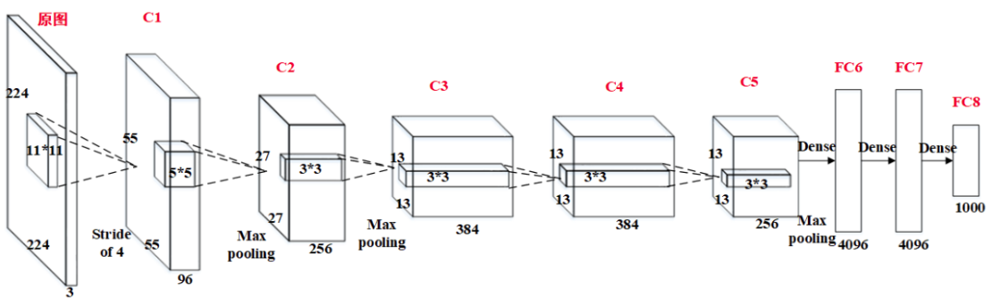

*上图中模型参数并不代表实际情况，只为说明`Alexnet`网络模型结构，具体见代码内实际参数设置。*

- 构建卷积`block`

```python
class ConvBlock(nn.Module):
    """Conv2d -> BatchNorm -> Activation"""
    
    def __init__(self, in_channels, out_channels, kernel_size=3, stride=1, padding=1, batch_norm=False):
        super(ConvBlock, self).__init__()
        layers = list()
        layers.append(nn.Conv2d(in_channels, out_channels, kernel_size, stride, padding=padding))
        if batch_norm:
            layers.append(nn.BatchNorm2d(out_channels))
        layers.append(nn.ReLU(inplace=True))
        self.block = nn.Sequential(*layers)
        
    def forward(self, x, verbose=False):
        out = self.block(x)
        if verbose:
            print(x.shape, "->", out.shape)
        return out
```

- 特征提取模块

```python
def createWholeModel():
    backbone_layers = OrderedDict([
        ('l1', ConvBlock(in_channels=3, out_channels=64, kernel_size=3, stride=2)),
        ('l2', nn.MaxPool2d(kernel_size=2)),
        ('l3', ConvBlock(in_channels=64, out_channels=192)),
        ('l4', nn.MaxPool2d(kernel_size=2)),
        ('l5', ConvBlock(in_channels=192, out_channels=384)),
        ('l6', ConvBlock(in_channels=384, out_channels=256)),
        ('l7', ConvBlock(in_channels=256, out_channels=256)),
        ('l8', nn.MaxPool2d(kernel_size=2))
    ])
    return backbone_layers
```

- 构建`Alexnet`模型

```python
class Alexnet_whole(nn.Module):
    def __init__(self):
        super(Alexnet_whole, self).__init__()
        self.seq = nn.Sequential(createWholeModel())
        # self.classifier = Classifier(in_features=512)
        self.classifier = nn.Sequential(
            nn.Dropout(),
            nn.Linear(256 * 2 * 2, 4096),
            nn.ReLU(True),
            nn.Dropout(),
            nn.Linear(4096, 4096),
            nn.ReLU(True),
            nn.Linear(4096, 10)
        )
        
    def forward(self, x):
        x = self.seq(x)
        # batch_size = x.shape[0]
        # x = x.view(batch_size, -1)
        # x = x.view(x.size(0), -1)
        # x = torch.flatten(x, start_dim=1)
        x = x.view(x.size(0), 256 * 2 * 2)
        out = self.classifier(x)
        return out
```

##### 5、socket_utils.py

- 数据打包发送

添加前缀，并转换为独特形式字符串以字节形式发送

```python 
def send_msg(sock, msg):
    msg = pickle.dumps(msg)
    l_send = len(msg)
    msg = struct.pack('>I', l_send) + msg
    send_time = time.time()
    sock.sendall(msg)
    return l_send, send_time
```

- 数据解包接收

读取接收发送的数据，并解包为一个整型变量

```python
def recv_msg(sock):
    raw_msglen = recvall(sock, 4)
    if not raw_msglen:
        return None
    msglen = struct.unpack('>I', raw_msglen)[0]

    msg = recvall(sock, msglen)
    msg = pickle.loads(msg)
    recv_time = time.time()
    return msg, msglen, recv_time
```

- 辅助函数

辅助函数，接收 n 个字节的数据或在达到结束标识符 `EOF` 时返回 `None`

```python
def recvall(sock, n):
    data = b''
    while len(data) < n:
        packet = sock.recv(n - len(data))
        if not packet:
            return None
        data += packet
    return data
```

##### 6、settings_client.py

此处包含本项目客户端运行的大部分设置参数

- 获取 ip

此处分为两种模式，一种为win下获取IP，另一种为linux下获取IP，分别对应以下代码：

```python
# Windows
def get_realip():
    filename = "ip.swbd"
    # open(filename, "w").write("")
    os.system("ipconfig > {}".format(filename))
    text = open("{}".format(filename)).read()
    # print(text)
    
    try:
        ipv4 = re.findall(r'以太网适配器 以太网:(.*?)默认网关', text, re.S)[0]
        ipv4 = re.findall(r'IPv4 地址 . . . . . . . . . . . . :(.*?)子网掩码', ipv4, re.S)[0].replace(" ", "")
        print(ipv4)
    except:
        ipv4 = re.findall(r'无线局域网适配器 WLAN:(.*?)默认网关', text, re.S)[0]
        ipv4 = re.findall(r'IPv4 地址 . . . . . . . . . . . . :(.*?)子网掩码', ipv4, re.S)[0].replace(" ", "")
        print(ipv4)  
    os.remove(filename)
    
    return ipv4
    
#Linux
def getIP():
    """获取ipv4地址"""
    dic = psutil.net_if_addrs()
    ipv4_list = []
    
    for adapter in dic:
        snicList = dic[adapter]
        for snic in snicList:
            # if snic.family.name in {'AF_LINK', 'AF_PACKET'}:
            #     mac = snic.address
            if snic.family.name == 'AF_INET':
                ipv4 = snic.address
                if ipv4 != '127.0.0.1':
                    ipv4_list.append(ipv4)
            # elif snic.family.name == 'AF_INET6':
            #     ipv6 = snic.address  
    if len(ipv4_list) >= 1:
        return ipv4_list[0]
    else:
        return 'None'
```

- 参数设置代码

```python
client_addr = getIP()  # rapberryPi 适用
data_proportion = 0.3
device = torch.device('cuda' if torch.cuda.is_available() else 'cpu')
host = '192.168.3.109'
port = 10086

TRAIN_CONFIG = dict()
TRAIN_CONFIG["rounds"] = 2
TRAIN_CONFIG["batch_size"] = 100
TRAIN_CONFIG["client_name"] = 'rpi'
TRAIN_CONFIG["momentum"] = 0.9
TRAIN_CONFIG["weight_decay"] = 1e-5
TRAIN_CONFIG["lr"] = 1e-1  # 1e-1 * 2
TRAIN_CONFIG["lr_step"] = 40
TRAIN_CONFIG["n_epochs"] = 2
```

- 具体参数及含义

|     参数名      |      含义      |
| :-------------: | :------------: |
|   client_addr   |    客户端ip    |
| data_proportion | 客户端数据比例 |
|     device      |    运行环境    |
|      host       |    服务器IP    |
|      port       |   服务器端口   |
|     rounds      |   总训练轮数   |
|   batch_size    |   batch大小    |
|   client_name   |   客户端类型   |
|    momentum     | 优化器动量参数 |
|  weight_decay   |    权重衰减    |
|       lr        |     学习率     |
|     lr_step     |   学习率衰减   |
|    n_epochs     | 本地epoch数量  |

## 第三部分、服务器端部分代码设计

### 1、主要数据结构及含义

- 模型保存

```python
modelSavePt_c = 'FL_alexnet_global_model_save_round_' + str(r) + '_.pth'
torch.save(global_weights, modelSavePt_c)
```

- 训练模型

```python
alexmodel = Alexnet_whole()
alexmodel.to(settings.device)
```

- `socket`接口

```python
sock = socket.socket()
sock.bind((host, port))
sock.listen(100)
```

### 2、主要函数处理流程


##### 1、main_server.py

- 加载模型


```python
alexmodel = Alexnet_whole()
alexmodel.to(settings.device)
global_weights = copy.deepcopy(alexmodel.state_dict())
```

- 连接客户端启动线程

`accept()`函数负责从客户端“连接”的队列中返回一个新的`socket`套接字描述符，代表和客户端的新的连接，包含客户端`ip`和`port`信息，分别由`conn`和`addr`表示。调用`Thread()`函数，针对多客户端情况创建多个线程，`target=receive`以线程函数变量的形式调用`receive()`函数，数组变量参数`args`用以传递多个参数。`thread.start()`启动线程。

```python
for userid in range(settings.TRAIN_CONFIG['users']):
    conn, addr = sock.accept()
    print('Conntected with', addr[1])
    # append client socket on list
    print(userid)
    clientsoclist[userid] = conn
    print('socket list index {} records connection with client {}'.format(userid, clientsoclist[userid]))

    # receive(userid, num_users, conn, rounds)
    args = (userid, settings.TRAIN_CONFIG['users'], conn, settings.TRAIN_CONFIG["rounds"])
    thread = Thread(target=receive, args=args)
    thrs.append(thread)
    print("start thread of client {}".format(userid))
    thread.start()

for thread in thrs:
    thread.join()
```

- 接收客户端信息


通过`socket_utils.recv_msg(clientsoclist[userid])`接收来自多个客户端的训练信息。更新维护接收时间和接收数据大小等信息的列表，同时`weight_count`+1。用锁来控制多线程需要独占资源的情况，防止多个线程同时占用资源而出现异常。随后开启训练`train(userid, num_users, conn, rounds)`

```python
def receive(userid, num_users, conn, rounds): 
    global weight_count
    global server_total_receive_time_list
    global server_total_receivesize_list
    global client_data_size_list
    global clientNameList
  
    client_train_info, msg_length, recieve_time = socket_utils.recv_msg(clientsoclist[userid])
    client_data_size = int(client_train_info['train_data_len'])
    client_name = client_train_info['client_name']
    print("----------------- Received clients' train_info ------------")

    with lock:
        server_total_receive_time_list[userid].append(recieve_time)
        server_total_receivesize_list[userid].append(msg_length)
        client_data_size_list[userid] = client_data_size
        clientNameList[userid] = client_name
        weight_count += 1

    train(userid, num_users, conn, rounds)
```

- 服务端训练


对于每一轮全局训练，`weight_count==num_users`表示已经接收到所有参与客户端发送的模型参数信息。`torch.save(global_weights, modelSavePt_c)`将每一轮聚合好的全局模型权重保存本地文件，然后使用`socket_utils.send_msg(conn, global_weights)`将全局参数发送给各个参与客户端，并更新发送时间和发送数据大小列表，同时将变量`weight_count`置0。在客户端完成本地训练后，使用`socket_utils.recv_msg(client_conn)`接收来自各个客户端的模型数据，每接收一个客户端的模型参数，`weight_count+1`，等接收到所有参与客户端发送的信息后，调用`average_weights()`函数将客户端权重参数聚合求平均得到全局权重。

```python
def train(userid, num_users, client_conn, rounds):
    global server_model_weights_list
    global client_data_size_list
    global global_weights
    global weight_count

    for r in range(rounds):
        with lock:
            if weight_count == num_users:
                modelSavePt_c = 'FL_alexnet_global_model_save_round_' + str(r) + '_.pth'
                torch.save(global_weights, modelSavePt_c)
                for i, conn in enumerate(clientsoclist):
                    datasize1, send_time1 = socket_utils.send_msg(conn, global_weights)
                    print("----sent global weights to client {} ----".format(i))
                    server_total_send_time_list[userid].append(send_time1)
                    server_total_sendsize_list[userid].append(datasize1)
                    weight_count = 0
        client_weights, datasize2, rece_time2 = socket_utils.recv_msg(client_conn)

        with lock:
            server_total_receive_time_list[userid].append(rece_time2)
            server_total_receivesize_list[userid].append(datasize2)
            server_model_weights_list[userid] = client_weights
            
        print("Round {}: Received client {}'s weights".format(r, userid))
        
        with lock:
            weight_count += 1
            if weight_count == num_users:
                # average
                global_weights = average_weights(server_model_weights_list, client_data_size_list)
```

- 模型权重聚合平均


使用迭代器`enumerate`将各客户端模型权重根据客户端本地的数据集大小进行加权平均。

```python
def average_weights(w, datasizelist):
    for i, data in enumerate(datasizelist):
        for key in w[i].keys():
            w[i][key] = w[i][key] * float(data)

    w_avg = copy.deepcopy(w[0])
    
    for key in w_avg.keys():
        for i in range(1, len(w)):
            w_avg[key] += w[i][key]
        w_avg[key] = torch.div(w_avg[key], float(sum(datasizelist)))
        
    return w_avg
```

##### 2、socket_utils.py

- 数据打包发送

添加前缀，并转换为独特形式字符串以字节形式发送

```python 
def send_msg(sock, msg):
    msg = pickle.dumps(msg)
    l_send = len(msg)
    msg = struct.pack('>I', l_send) + msg
    send_time = time.time()
    sock.sendall(msg)
    return l_send, send_time
```

- 数据解包接收

读取接收发送的数据，并解包为一个整型变量

```python
def recv_msg(sock):
    raw_msglen = recvall(sock, 4)
    if not raw_msglen:
        return None
    msglen = struct.unpack('>I', raw_msglen)[0]

    msg = recvall(sock, msglen)
    msg = pickle.loads(msg)
    recv_time = time.time()
    return msg, msglen, recv_time
```

- 辅助函数

辅助函数，接收 n 个字节的数据或在达到结束标识符 `EOF` 时返回 `None`

```python
def recvall(sock, n):
    data = b''
    while len(data) < n:
        packet = sock.recv(n - len(data))
        if not packet:
            return None
        data += packet
    return data
```

##### 3、alexnet.py

定义`Alexnet`网络模型，模型包括特征提取模块和分类模块。其中特征提取模块由5个卷积层，3个最大池化层组成；分类模块由三层全连接层组成，最终输出10个二维张量表示分类预测的结果，其中正则化为`dropout`，激活函数为`ReLu`。

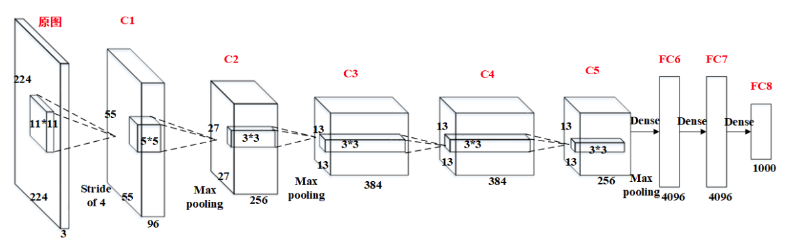

*上图中模型参数并不代表实际情况，只为说明`Alexnet`网络模型结构，具体见代码卷积核参数。*

- 构建卷积`block`

```python
class ConvBlock(nn.Module):
    """Conv2d -> BatchNorm -> Activation"""
    
    def __init__(self, in_channels, out_channels, kernel_size=3, stride=1, padding=1, batch_norm=False):
        super(ConvBlock, self).__init__()
        layers = list()
        layers.append(nn.Conv2d(in_channels, out_channels, kernel_size, stride, padding=padding))
        if batch_norm:
            layers.append(nn.BatchNorm2d(out_channels))
        layers.append(nn.ReLU(inplace=True))
        self.block = nn.Sequential(*layers)
        
    def forward(self, x, verbose=False):
        out = self.block(x)
        if verbose:
            print(x.shape, "->", out.shape)
        return out
```

- 特征提取模块

```python
def createWholeModel():
    backbone_layers = OrderedDict([
        ('l1', ConvBlock(in_channels=3, out_channels=64, kernel_size=3, stride=2)),
        ('l2', nn.MaxPool2d(kernel_size=2)),
        ('l3', ConvBlock(in_channels=64, out_channels=192)),
        ('l4', nn.MaxPool2d(kernel_size=2)),
        ('l5', ConvBlock(in_channels=192, out_channels=384)),
        ('l6', ConvBlock(in_channels=384, out_channels=256)),
        ('l7', ConvBlock(in_channels=256, out_channels=256)),
        ('l8', nn.MaxPool2d(kernel_size=2))
    ])
    return backbone_layers
```

- 构建`Alexnet`模型

```python
class Alexnet_whole(nn.Module):
    def __init__(self):
        super(Alexnet_whole, self).__init__()
        self.seq = nn.Sequential(createWholeModel())
        # self.classifier = Classifier(in_features=512)
        self.classifier = nn.Sequential(
            nn.Dropout(),
            nn.Linear(256 * 2 * 2, 4096),
            nn.ReLU(True),
            nn.Dropout(),
            nn.Linear(4096, 4096),
            nn.ReLU(True),
            nn.Linear(4096, 10)
        )
        
    def forward(self, x):
        x = self.seq(x)
        # batch_size = x.shape[0]
        # x = x.view(batch_size, -1)
        # x = x.view(x.size(0), -1)
        # x = torch.flatten(x, start_dim=1)
        x = x.view(x.size(0), 256 * 2 * 2)
        out = self.classifier(x)
        return out
```

##### 4、settings_server.py

- 参数设置代码

```python
device = torch.device("cuda" if torch.cuda.is_available() else "cpu")
host = '192.168.3.109'
port = 10086

TRAIN_CONFIG = dict()

TRAIN_CONFIG["model_name"] = "server_Alexnet"
TRAIN_CONFIG["lr"] = 1e-1  
TRAIN_CONFIG["lr_step"] = 40
TRAIN_CONFIG["momentum"] = 0.9
TRAIN_CONFIG["weight_decay"] = 1e-5
TRAIN_CONFIG["rounds"] = 3
TRAIN_CONFIG["users"] = 2
```

- 具体参数及含义

|    参数名    |      含义      |
| :----------: | :------------: |
|    device    |    运行环境    |
|     host     |    服务器IP    |
|     port     |   服务器端口   |
|      lr      |     学习率     |
|   lr_step    |   学习率衰减   |
|   momentum   | 优化器动量参数 |
| weight_decay |    权重衰减    |
|    rounds    |   总训练轮数   |
|    users     | 参与客户端数量 |

## 第四部分、部署与测试

### 1、建议部署环境

|                     服务端                      |                     客户端                      |
| :---------------------------------------------: | :---------------------------------------------: |
| Intel(R) Core(TM) i7-7700CPU@3.60GHz   3.60 GHz | Intel(R) Core(TM) i7-7700CPU@3.60GHz   3.60 GHz |
|                     16.0 GB                     |                     16.0 GB                     |
|                    x64处理器                    |                    x64处理器                    |
|                   python 3.9                    |                   python 3.9                    |

### 2、建议配置参数

|     参数名      | 建议值 |
| :-------------: | :----: |
|       lr        |  1e-1  |
|     lr_step     |   40   |
|    momentum     |  0.9   |
|  weight_decay   |  1e-5  |
| data_proportion |  0.3   |
|     rounds      |   70   |
|   batch_size    |  512   |
|    n_epochs     |   5    |

### 3、简单的使用流程


1. 确认服务端和客户端共有文件，包括模型文件和`socket`文件；
2. 分别设置服务端和客户端`setting`文件内的超参数，包括训练轮数、`batch_size`以及客户端数量等参数；
3. 运行`main_server.py`脚本启动服务端；
4. 运行`client.py`脚本启动客户端。（针对启动多客户端参与联邦学习训练场景，将`client`目录文件部署到各个客户端即可）

### 4、其他注意问题

- 确保启动客户端个数与`users`参数设置保持一致，否则服务端接收不到指定的`weight_count`会陷入持续等待，无法正常训练。
- `mobilenetv2.py`和`alexnet.py`定义不同的网络模型，本文档是对使用`alexnet`模型训练进行说明。两者差异主要存在于模型结构，训练流程和超参数设置基本一致。`mobilenetv2`模型对应的配置文件为`settings.py`，对应于`alexnet`模型的`settings_server.py`。
- 文档中的参数设置和部署环境均为测试所用，实际应用中可根据真实情况灵活调整，不要求必须实现同样配置。
